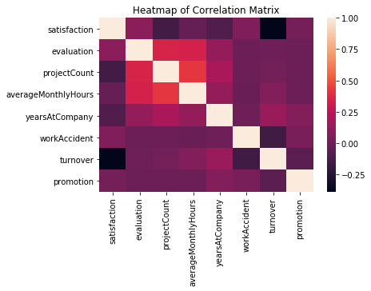
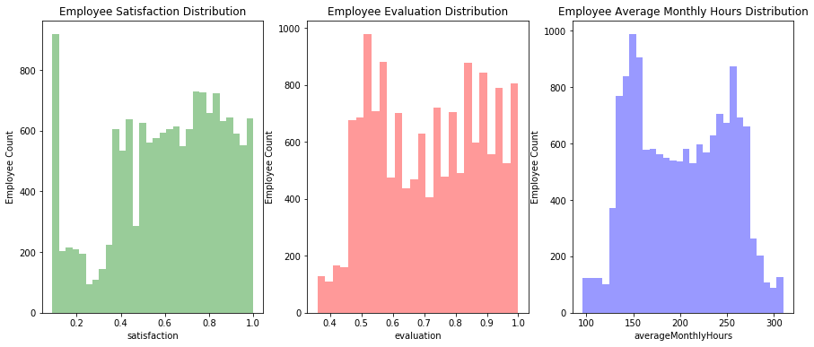
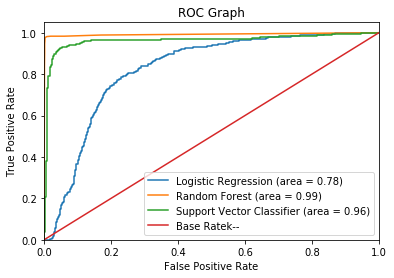
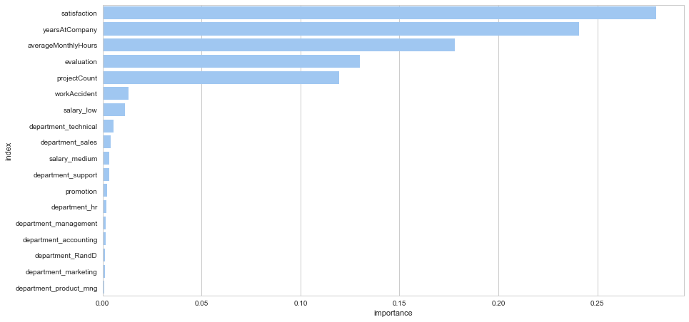

# Understanding and Predicting Employee Turnover
https://media.giphy.com/media/l3979tir6x4dF20j6/giphy.gif"

**"I quit..."** This is the last thing anybody wants to hear from their employees. In a sense, it’s the employees who make the company. It’s the employees who do the work. It’s the employees who shape the company’s culture. Long-term success, a healthy work environment, and high employee retention are all signs of a successful company. But when a company experiences a high rate of employee turnover, then something is going wrong. This can lead the company to huge monetary losses by these innovative and valuable employees.


Companies that maintain a healthy organization and culture are always a good sign of future prosperity. Recognizing and understanding what factors that were associated with employee turnover will allow companies and individuals to limit this from happening and may even increase employee productivity and growth. These predictive insights give managers the opportunity to take corrective steps to build and preserve their successful business.

**"You don't build a business. You build people, and people build the business." - Zig Ziglar**
***

## HR Analytics
***

### Objective: 
- To understand what factors contributed most to employee turnover.

- To perform clustering to find any meaningful patterns of employee traits.

- To create a model that predicts the likelihood if a certain employee will leave the company or not. 

- To create or improve different retention strategies on targeted employees. 

The implementation of this model will allow management to create better decision-making actions.


### The Problem:

One of the most common problems at work is **turnover.** 

Replacing a worker earning about **50,000 dollars** cost the company about **10,000 dollars** or 20% of that worker’s yearly income according to the Center of American Progress.

Replacing a high-level employee can cost multiple of that...

**Cost include:**
- Cost of off-boarding 
- Cost of hiring (advertising, interviewing, hiring)
- Cost of onboarding a new person (training, management time)
- Lost productivity (a new person may take 1-2 years to reach the productivity of an existing person)


# Import Packages
***


```python
# Import the neccessary modules for data manipulation and visual representation
import pandas as pd
import numpy as np
import matplotlib.pyplot as plt
import matplotlib as matplot
import seaborn as sns
%matplotlib inline
```

# Read the Data
***


```python
df = pd.read_csv('HR_comma_sep.csv.txt')
```


```python
# Examine the dataset
df.head()
```


<div>
<table border="1" class="dataframe">
  <thead>
    <tr style="text-align: right;">
      <th></th>
      <th>satisfaction_level</th>
      <th>last_evaluation</th>
      <th>number_project</th>
      <th>average_montly_hours</th>
      <th>time_spend_company</th>
      <th>Work_accident</th>
      <th>left</th>
      <th>promotion_last_5years</th>
      <th>sales</th>
      <th>salary</th>
    </tr>
  </thead>
  <tbody>
    <tr>
      <th>0</th>
      <td>0.38</td>
      <td>0.53</td>
      <td>2</td>
      <td>157</td>
      <td>3</td>
      <td>0</td>
      <td>1</td>
      <td>0</td>
      <td>sales</td>
      <td>low</td>
    </tr>
    <tr>
      <th>1</th>
      <td>0.80</td>
      <td>0.86</td>
      <td>5</td>
      <td>262</td>
      <td>6</td>
      <td>0</td>
      <td>1</td>
      <td>0</td>
      <td>sales</td>
      <td>medium</td>
    </tr>
    <tr>
      <th>2</th>
      <td>0.11</td>
      <td>0.88</td>
      <td>7</td>
      <td>272</td>
      <td>4</td>
      <td>0</td>
      <td>1</td>
      <td>0</td>
      <td>sales</td>
      <td>medium</td>
    </tr>
    <tr>
      <th>3</th>
      <td>0.72</td>
      <td>0.87</td>
      <td>5</td>
      <td>223</td>
      <td>5</td>
      <td>0</td>
      <td>1</td>
      <td>0</td>
      <td>sales</td>
      <td>low</td>
    </tr>
    <tr>
      <th>4</th>
      <td>0.37</td>
      <td>0.52</td>
      <td>2</td>
      <td>159</td>
      <td>3</td>
      <td>0</td>
      <td>1</td>
      <td>0</td>
      <td>sales</td>
      <td>low</td>
    </tr>
  </tbody>
</table>
</div>


# Data Quality Check
***


```python
# Can you check to see if there are any missing values in our data set
df.isnull().any()
```


    satisfaction_level       False
    last_evaluation          False
    number_project           False
    average_montly_hours     False
    time_spend_company       False
    Work_accident            False
    left                     False
    promotion_last_5years    False
    sales                    False
    salary                   False
    dtype: bool


```python
# Rename Columns
# Renaming certain columns for better readability
df = df.rename(columns={'satisfaction_level': 'satisfaction', 
                        'last_evaluation': 'evaluation',
                        'number_project': 'projectCount',
                        'average_montly_hours': 'averageMonthlyHours',
                        'time_spend_company': 'yearsAtCompany',
                        'Work_accident': 'workAccident',
                        'promotion_last_5years': 'promotion',
                        'sales' : 'department',
                        'left' : 'turnover'
                        })

df.head(3)
```


<div>
<table border="1" class="dataframe">
  <thead>
    <tr style="text-align: right;">
      <th></th>
      <th>satisfaction</th>
      <th>evaluation</th>
      <th>projectCount</th>
      <th>averageMonthlyHours</th>
      <th>yearsAtCompany</th>
      <th>workAccident</th>
      <th>turnover</th>
      <th>promotion</th>
      <th>department</th>
      <th>salary</th>
    </tr>
  </thead>
  <tbody>
    <tr>
      <th>0</th>
      <td>0.38</td>
      <td>0.53</td>
      <td>2</td>
      <td>157</td>
      <td>3</td>
      <td>0</td>
      <td>1</td>
      <td>0</td>
      <td>sales</td>
      <td>low</td>
    </tr>
    <tr>
      <th>1</th>
      <td>0.80</td>
      <td>0.86</td>
      <td>5</td>
      <td>262</td>
      <td>6</td>
      <td>0</td>
      <td>1</td>
      <td>0</td>
      <td>sales</td>
      <td>medium</td>
    </tr>
    <tr>
      <th>2</th>
      <td>0.11</td>
      <td>0.88</td>
      <td>7</td>
      <td>272</td>
      <td>4</td>
      <td>0</td>
      <td>1</td>
      <td>0</td>
      <td>sales</td>
      <td>medium</td>
    </tr>
  </tbody>
</table>
</div>


```python
# Check the type of our features. Are there any data inconsistencies?
df.dtypes
```


    satisfaction           float64
    evaluation             float64
    projectCount             int64
    averageMonthlyHours      int64
    yearsAtCompany           int64
    workAccident             int64
    turnover                 int64
    promotion                int64
    department              object
    salary                  object
    dtype: object


# Exploratory Data Analysis
***


```python
# How many employees are in the dataset?
df.shape
```


    (14999, 10)


```python
# Calculate the turnover rate of our company's dataset. What's the rate of turnover?
turnover_rate = df.turnover.value_counts() / 14999
turnover_rate
```


    0    0.761917
    1    0.238083
    Name: turnover, dtype: float64


```python
# Display the statistical overview of the employees
df.describe()
```


<div>
<table border="1" class="dataframe">
  <thead>
    <tr style="text-align: right;">
      <th></th>
      <th>satisfaction</th>
      <th>evaluation</th>
      <th>projectCount</th>
      <th>averageMonthlyHours</th>
      <th>yearsAtCompany</th>
      <th>workAccident</th>
      <th>turnover</th>
      <th>promotion</th>
    </tr>
  </thead>
  <tbody>
    <tr>
      <th>count</th>
      <td>14999.000000</td>
      <td>14999.000000</td>
      <td>14999.000000</td>
      <td>14999.000000</td>
      <td>14999.000000</td>
      <td>14999.000000</td>
      <td>14999.000000</td>
      <td>14999.000000</td>
    </tr>
    <tr>
      <th>mean</th>
      <td>0.612834</td>
      <td>0.716102</td>
      <td>3.803054</td>
      <td>201.050337</td>
      <td>3.498233</td>
      <td>0.144610</td>
      <td>0.238083</td>
      <td>0.021268</td>
    </tr>
    <tr>
      <th>std</th>
      <td>0.248631</td>
      <td>0.171169</td>
      <td>1.232592</td>
      <td>49.943099</td>
      <td>1.460136</td>
      <td>0.351719</td>
      <td>0.425924</td>
      <td>0.144281</td>
    </tr>
    <tr>
      <th>min</th>
      <td>0.090000</td>
      <td>0.360000</td>
      <td>2.000000</td>
      <td>96.000000</td>
      <td>2.000000</td>
      <td>0.000000</td>
      <td>0.000000</td>
      <td>0.000000</td>
    </tr>
    <tr>
      <th>25%</th>
      <td>0.440000</td>
      <td>0.560000</td>
      <td>3.000000</td>
      <td>156.000000</td>
      <td>3.000000</td>
      <td>0.000000</td>
      <td>0.000000</td>
      <td>0.000000</td>
    </tr>
    <tr>
      <th>50%</th>
      <td>0.640000</td>
      <td>0.720000</td>
      <td>4.000000</td>
      <td>200.000000</td>
      <td>3.000000</td>
      <td>0.000000</td>
      <td>0.000000</td>
      <td>0.000000</td>
    </tr>
    <tr>
      <th>75%</th>
      <td>0.820000</td>
      <td>0.870000</td>
      <td>5.000000</td>
      <td>245.000000</td>
      <td>4.000000</td>
      <td>0.000000</td>
      <td>0.000000</td>
      <td>0.000000</td>
    </tr>
    <tr>
      <th>max</th>
      <td>1.000000</td>
      <td>1.000000</td>
      <td>7.000000</td>
      <td>310.000000</td>
      <td>10.000000</td>
      <td>1.000000</td>
      <td>1.000000</td>
      <td>1.000000</td>
    </tr>
  </tbody>
</table>
</div>


```python
# Display the mean summary of Employees (Turnover V.S. Non-turnover). What do you notice between the groups?
turnover_Summary = df.groupby('turnover')
turnover_Summary.mean()
```


<div>
<table border="1" class="dataframe">
  <thead>
    <tr style="text-align: right;">
      <th></th>
      <th>satisfaction</th>
      <th>evaluation</th>
      <th>projectCount</th>
      <th>averageMonthlyHours</th>
      <th>yearsAtCompany</th>
      <th>workAccident</th>
      <th>promotion</th>
    </tr>
    <tr>
      <th>turnover</th>
      <th></th>
      <th></th>
      <th></th>
      <th></th>
      <th></th>
      <th></th>
      <th></th>
    </tr>
  </thead>
  <tbody>
    <tr>
      <th>0</th>
      <td>0.666810</td>
      <td>0.715473</td>
      <td>3.786664</td>
      <td>199.060203</td>
      <td>3.380032</td>
      <td>0.175009</td>
      <td>0.026251</td>
    </tr>
    <tr>
      <th>1</th>
      <td>0.440098</td>
      <td>0.718113</td>
      <td>3.855503</td>
      <td>207.419210</td>
      <td>3.876505</td>
      <td>0.047326</td>
      <td>0.005321</td>
    </tr>
  </tbody>
</table>
</div>


```python
# Create a correlation matrix. What features correlate the most with turnover? What other correlations did you find?
corr = df.corr()
corr = (corr)
sns.heatmap(corr, 
            xticklabels=corr.columns.values,
            yticklabels=corr.columns.values)
plt.title('Heatmap of Correlation Matrix')
corr
```


<div>
<table border="1" class="dataframe">
  <thead>
    <tr style="text-align: right;">
      <th></th>
      <th>satisfaction</th>
      <th>evaluation</th>
      <th>projectCount</th>
      <th>averageMonthlyHours</th>
      <th>yearsAtCompany</th>
      <th>workAccident</th>
      <th>turnover</th>
      <th>promotion</th>
    </tr>
  </thead>
  <tbody>
    <tr>
      <th>satisfaction</th>
      <td>1.000000</td>
      <td>0.105021</td>
      <td>-0.142970</td>
      <td>-0.020048</td>
      <td>-0.100866</td>
      <td>0.058697</td>
      <td>-0.388375</td>
      <td>0.025605</td>
    </tr>
    <tr>
      <th>evaluation</th>
      <td>0.105021</td>
      <td>1.000000</td>
      <td>0.349333</td>
      <td>0.339742</td>
      <td>0.131591</td>
      <td>-0.007104</td>
      <td>0.006567</td>
      <td>-0.008684</td>
    </tr>
    <tr>
      <th>projectCount</th>
      <td>-0.142970</td>
      <td>0.349333</td>
      <td>1.000000</td>
      <td>0.417211</td>
      <td>0.196786</td>
      <td>-0.004741</td>
      <td>0.023787</td>
      <td>-0.006064</td>
    </tr>
    <tr>
      <th>averageMonthlyHours</th>
      <td>-0.020048</td>
      <td>0.339742</td>
      <td>0.417211</td>
      <td>1.000000</td>
      <td>0.127755</td>
      <td>-0.010143</td>
      <td>0.071287</td>
      <td>-0.003544</td>
    </tr>
    <tr>
      <th>yearsAtCompany</th>
      <td>-0.100866</td>
      <td>0.131591</td>
      <td>0.196786</td>
      <td>0.127755</td>
      <td>1.000000</td>
      <td>0.002120</td>
      <td>0.144822</td>
      <td>0.067433</td>
    </tr>
    <tr>
      <th>workAccident</th>
      <td>0.058697</td>
      <td>-0.007104</td>
      <td>-0.004741</td>
      <td>-0.010143</td>
      <td>0.002120</td>
      <td>1.000000</td>
      <td>-0.154622</td>
      <td>0.039245</td>
    </tr>
    <tr>
      <th>turnover</th>
      <td>-0.388375</td>
      <td>0.006567</td>
      <td>0.023787</td>
      <td>0.071287</td>
      <td>0.144822</td>
      <td>-0.154622</td>
      <td>1.000000</td>
      <td>-0.061788</td>
    </tr>
    <tr>
      <th>promotion</th>
      <td>0.025605</td>
      <td>-0.008684</td>
      <td>-0.006064</td>
      <td>-0.003544</td>
      <td>0.067433</td>
      <td>0.039245</td>
      <td>-0.061788</td>
      <td>1.000000</td>
    </tr>
  </tbody>
</table>
</div>





```python
# Plot the distribution of Employee Satisfaction, Evaluation, and Project Count. What story can you tell?


# Set up the matplotlib figure
f, axes = plt.subplots(ncols=3, figsize=(15, 6))

# Graph Employee Satisfaction
sns.distplot(df.satisfaction, kde=False, color="g", ax=axes[0]).set_title('Employee Satisfaction Distribution')
axes[0].set_ylabel('Employee Count')

# Graph Employee Evaluation
sns.distplot(df.evaluation, kde=False, color="r", ax=axes[1]).set_title('Employee Evaluation Distribution')
axes[1].set_ylabel('Employee Count')

# Graph Employee Average Monthly Hours
sns.distplot(df.averageMonthlyHours, kde=False, color="b", ax=axes[2]).set_title('Employee Average Monthly Hours Distribution')
axes[2].set_ylabel('Employee Count')
```

 


# Pre-processing 
***

Apply get_dummies() to the categorical variables. Seperate categorical variables and numeric variables, then combine them.


```python
cat_var = ['department','salary','turnover','promotion']
num_var = ['satisfaction','evaluation','projectCount','averageMonthlyHours','yearsAtCompany', 'workAccident']
categorical_df = pd.get_dummies(df[cat_var], drop_first=True)
numerical_df = df[num_var]

new_df = pd.concat([categorical_df,numerical_df], axis=1)
new_df.head()
```


<div>
<table border="1" class="dataframe">
  <thead>
    <tr style="text-align: right;">
      <th></th>
      <th>turnover</th>
      <th>promotion</th>
      <th>department_RandD</th>
      <th>department_accounting</th>
      <th>department_hr</th>
      <th>department_management</th>
      <th>department_marketing</th>
      <th>department_product_mng</th>
      <th>department_sales</th>
      <th>department_support</th>
      <th>department_technical</th>
      <th>salary_low</th>
      <th>salary_medium</th>
      <th>satisfaction</th>
      <th>evaluation</th>
      <th>projectCount</th>
      <th>averageMonthlyHours</th>
      <th>yearsAtCompany</th>
      <th>workAccident</th>
    </tr>
  </thead>
  <tbody>
    <tr>
      <th>0</th>
      <td>1</td>
      <td>0</td>
      <td>0</td>
      <td>0</td>
      <td>0</td>
      <td>0</td>
      <td>0</td>
      <td>0</td>
      <td>1</td>
      <td>0</td>
      <td>0</td>
      <td>1</td>
      <td>0</td>
      <td>0.38</td>
      <td>0.53</td>
      <td>2</td>
      <td>157</td>
      <td>3</td>
      <td>0</td>
    </tr>
    <tr>
      <th>1</th>
      <td>1</td>
      <td>0</td>
      <td>0</td>
      <td>0</td>
      <td>0</td>
      <td>0</td>
      <td>0</td>
      <td>0</td>
      <td>1</td>
      <td>0</td>
      <td>0</td>
      <td>0</td>
      <td>1</td>
      <td>0.80</td>
      <td>0.86</td>
      <td>5</td>
      <td>262</td>
      <td>6</td>
      <td>0</td>
    </tr>
    <tr>
      <th>2</th>
      <td>1</td>
      <td>0</td>
      <td>0</td>
      <td>0</td>
      <td>0</td>
      <td>0</td>
      <td>0</td>
      <td>0</td>
      <td>1</td>
      <td>0</td>
      <td>0</td>
      <td>0</td>
      <td>1</td>
      <td>0.11</td>
      <td>0.88</td>
      <td>7</td>
      <td>272</td>
      <td>4</td>
      <td>0</td>
    </tr>
    <tr>
      <th>3</th>
      <td>1</td>
      <td>0</td>
      <td>0</td>
      <td>0</td>
      <td>0</td>
      <td>0</td>
      <td>0</td>
      <td>0</td>
      <td>1</td>
      <td>0</td>
      <td>0</td>
      <td>1</td>
      <td>0</td>
      <td>0.72</td>
      <td>0.87</td>
      <td>5</td>
      <td>223</td>
      <td>5</td>
      <td>0</td>
    </tr>
    <tr>
      <th>4</th>
      <td>1</td>
      <td>0</td>
      <td>0</td>
      <td>0</td>
      <td>0</td>
      <td>0</td>
      <td>0</td>
      <td>0</td>
      <td>1</td>
      <td>0</td>
      <td>0</td>
      <td>1</td>
      <td>0</td>
      <td>0.37</td>
      <td>0.52</td>
      <td>2</td>
      <td>159</td>
      <td>3</td>
      <td>0</td>
    </tr>
  </tbody>
</table>
</div>


# Split Train/Test Set
***


```python
from sklearn.model_selection import train_test_split
from sklearn.metrics import accuracy_score, classification_report, precision_score, recall_score, confusion_matrix, precision_recall_curve
```


```python
# Create the X and y set
X = new_df.iloc[:,1:]
y = new_df.iloc[:,0]

# Define train and test
X_train, X_test, y_train, y_test = train_test_split(X,y,test_size=0.15, random_state=123, stratify=y)
```

# Train Logistic Regression Model
***


```python
%%time

# Check accuracy of Logistic Model# Check  
from sklearn.linear_model import LogisticRegression

# Define the Logistic Regression Model
lr = LogisticRegression(class_weight='balanced')

# Fit the Logistic Regression Model to the train set
lr.fit(X_train, y_train)
print ("Logistic accuracy is %2.2f" % accuracy_score(y_test, lr.predict(X_test)))

```

    Logistic accuracy is 0.77
    Wall time: 110 ms
    

### Apply 10-Fold Cross Validation for Logistic Regression


```python
%%time
from sklearn import model_selection

# Define the 10-Fold Cross Validation
kfold = model_selection.KFold(n_splits=10, random_state=7)

# Define the Logistic Regression Model
lrCV = LogisticRegression()

# Define the evaluation metric 
scoring = 'roc_auc'

# Train the Logistic Regression Model on the 10-Fold Cross Validation
lr_results = model_selection.cross_val_score(lrCV, X_train, y_train, cv=kfold, scoring=scoring)
```

    Wall time: 628 ms
    


```python
# Print out the 10 scores from the training. Notice how you get a wide range of scores compared to one single training
lr_results
```


    array([0.79845385, 0.8371952 , 0.82284329, 0.8179427 , 0.80693377,
           0.83157279, 0.82354362, 0.82073686, 0.80722612, 0.83976854])


### Average Score 

Let's use AUC as a general baseline to compare our model's performance. After comparing, we can then select the best one and look at its precision and recall.


```python
# Print out the mean and standard deviation of the training score
lr_auc = lr_results.mean()
print("The Logistic Regression AUC: %.3f and the STD is (%.3f)" % (lr_auc, lr_results.std()))
```

    The Logistic Regression AUC: 0.821 and the STD is (0.013)
    

### Logistic Regression AUC (0.78)


```python
from sklearn.metrics import roc_auc_score

print ("\n\n ---Logistic Regression Model---")
lr_auc = roc_auc_score(y_test, lr.predict(X_test))
print ("Logistic Regression AUC = %2.2f" % lr_auc)
print(classification_report(y_test, lr.predict(X_test)))
```

    
    
     ---Logistic Regression Model---
    Logistic Regression AUC = 0.78
                 precision    recall  f1-score   support
    
              0       0.92      0.76      0.83      1714
              1       0.50      0.80      0.62       536
    
    avg / total       0.82      0.77      0.78      2250
    
    

# Train Random Forest Classifier Model
***

Notice how the random forest classifier takes a while to run on the dataset. That is one downside to the algorithm, it takes a lot of computation. But it has a better performance than the sipler models like Logistic Regression


```python
%%time

from sklearn.ensemble import RandomForestClassifier

# Random Forest Model
rf = RandomForestClassifier(
    class_weight="balanced"
    )

# Fit the RF Model
rf = rf.fit(X_train, y_train)
```

    Wall time: 321 ms
    

### Apply 10-Fold Cross Validation for Random Forest


```python
%%time
rf_results = model_selection.cross_val_score(rf, X_train, y_train, cv=kfold, scoring=scoring)
rf_results
```

    Wall time: 1.6 s
    

### Average Score


```python
# Print out the mean and standard deviation of the training score
rf_auc = rf_results.mean()
print("The Random Forest AUC: %.3f and the STD is (%.3f)" % (rf_auc, rf_results.std()))
```

    The Random Forest AUC: 0.988 and the STD is (0.004)
    

### Random Forest AUC (0.99)


```python
from sklearn.metrics import roc_auc_score

print ("\n\n ---Random Forest Model---")
rf_roc_auc = roc_auc_score(y_test, rf.predict(X_test))
print ("Random Forest AUC = %2.2f" % rf_roc_auc)
print(classification_report(y_test, rf.predict(X_test)))
```

    
    
     ---Random Forest Model---
    Random Forest AUC = 0.99
                 precision    recall  f1-score   support
    
              0       0.99      1.00      0.99      1714
              1       0.99      0.98      0.98       536
    
    avg / total       0.99      0.99      0.99      2250
    
    

# Support Vector Classifier


```python
%%time 

from sklearn.svm import SVC 

svclassifier = SVC(kernel='rbf', probability=True)  

svc = svclassifier.fit(X_train,y_train)
```

    Wall time: 26.7 s
    


```python
%%time

svc_result = model_selection.cross_val_score(svc, X_train, y_train, cv=kfold, scoring=scoring)
svc_result
```

    Wall time: 46.2 s
    


```python
# Print out the mean and standard deviation of the training score
svc_auc = svc_result.mean()
print("The Supper Vector Classifier AUC: %.3f and the STD is (%.3f)" % (rf_auc, rf_results.std()))
```

    The Supper Vector Classifier AUC: 0.988 and the STD is (0.004)
    


```python
from sklearn.metrics import roc_auc_score

print ("\n\n ---Support Vector Model---")
rf_roc_auc = roc_auc_score(y_test, rf.predict(X_test))
print ("Support Vector Classifier AUC = %2.2f" % rf_roc_auc)
print(classification_report(y_test, rf.predict(X_test)))
```

    
    
     ---Support Vector Model---
    Support Vector Classifier AUC = 0.99
                 precision    recall  f1-score   support
    
              0       0.99      1.00      0.99      1714
              1       0.99      0.98      0.98       536
    
    avg / total       0.99      0.99      0.99      2250
    
    

# ROC Graph


```python
# Create ROC Graph
from sklearn.metrics import roc_curve
fpr, tpr, thresholds = roc_curve(y_test, lr.predict_proba(X_test)[:,1])
rf_fpr, rf_tpr, rf_thresholds = roc_curve(y_test, rf.predict_proba(X_test)[:,1])
svc_fpr, svc_tpr, svc_thresholds = roc_curve(y_test, svc.predict_proba(X_test)[:,1])


plt.figure()

# Plot Logistic Regression ROC
plt.plot(fpr, tpr, label='Logistic Regression (area = %0.2f)' % lr_auc)

# Plot Random Forest ROC
plt.plot(rf_fpr, rf_tpr, label='Random Forest (area = %0.2f)' % rf_auc)

# Plot Decision Tree ROC
plt.plot(svc_fpr, svc_tpr, label='Support Vector Classifier (area = %0.2f)' % svc_auc)

# Plot Base Rate ROC
plt.plot([0,1], [0,1],label='Base Rate' 'k--')

plt.xlim([0.0, 1.0])
plt.ylim([0.0, 1.05])
plt.xlabel('False Positive Rate')
plt.ylabel('True Positive Rate')
plt.title('ROC Graph')
plt.legend(loc="lower right")
plt.show()
```





# Random Forest Feature Importances


```python
# Get Feature Importances
feature_importances = pd.DataFrame(rf.feature_importances_,
                                   index = X_train.columns,
                                    columns=['importance']).sort_values('importance', ascending=False)
feature_importances = feature_importances.reset_index()
feature_importances
```


<div>
<table border="1" class="dataframe">
  <thead>
    <tr style="text-align: right;">
      <th></th>
      <th>index</th>
      <th>importance</th>
    </tr>
  </thead>
  <tbody>
    <tr>
      <th>0</th>
      <td>satisfaction</td>
      <td>0.279718</td>
    </tr>
    <tr>
      <th>1</th>
      <td>yearsAtCompany</td>
      <td>0.240698</td>
    </tr>
    <tr>
      <th>2</th>
      <td>averageMonthlyHours</td>
      <td>0.178100</td>
    </tr>
    <tr>
      <th>3</th>
      <td>evaluation</td>
      <td>0.129985</td>
    </tr>
    <tr>
      <th>4</th>
      <td>projectCount</td>
      <td>0.119583</td>
    </tr>
    <tr>
      <th>5</th>
      <td>workAccident</td>
      <td>0.013300</td>
    </tr>
    <tr>
      <th>6</th>
      <td>salary_low</td>
      <td>0.011167</td>
    </tr>
    <tr>
      <th>7</th>
      <td>department_technical</td>
      <td>0.005552</td>
    </tr>
    <tr>
      <th>8</th>
      <td>department_sales</td>
      <td>0.004075</td>
    </tr>
    <tr>
      <th>9</th>
      <td>salary_medium</td>
      <td>0.003387</td>
    </tr>
    <tr>
      <th>10</th>
      <td>department_support</td>
      <td>0.003291</td>
    </tr>
    <tr>
      <th>11</th>
      <td>promotion</td>
      <td>0.002225</td>
    </tr>
    <tr>
      <th>12</th>
      <td>department_hr</td>
      <td>0.002103</td>
    </tr>
    <tr>
      <th>13</th>
      <td>department_management</td>
      <td>0.001688</td>
    </tr>
    <tr>
      <th>14</th>
      <td>department_accounting</td>
      <td>0.001502</td>
    </tr>
    <tr>
      <th>15</th>
      <td>department_RandD</td>
      <td>0.001363</td>
    </tr>
    <tr>
      <th>16</th>
      <td>department_marketing</td>
      <td>0.001333</td>
    </tr>
    <tr>
      <th>17</th>
      <td>department_product_mng</td>
      <td>0.000928</td>
    </tr>
  </tbody>
</table>
</div>


```python
sns.set(style="whitegrid")

# Initialize the matplotlib figure
f, ax = plt.subplots(figsize=(13, 7))

# Plot the total schools per city
sns.set_color_codes("pastel")
sns.barplot(x="importance", y='index', data=feature_importances,
            label="Total", color="b")
```


    <matplotlib.axes._subplots.AxesSubplot at 0x1d0835083c8>





# Retention PLan

Since this model is being used for people, we should refrain from soley relying on the output of our model. Instead, we can use it's probability output and design our own system to treat each employee accordingly. 

1.	**Safe Zone (Green)** – Employees within this zone are considered safe. 
2.	**Low Risk Zone (Yellow)** – Employees within this zone are too be taken into consideration of potential turnover. This is more of a long-term track.
3.	**Medium Risk Zone (Orange)** – Employees within this zone are at risk of turnover. Action should be taken and monitored accordingly. 
4.	**High Risk Zone (Red)** – Employees within this zone are considered to have the highest chance of turnover. Action should be taken immediately. 


```python
rf.predict_proba(X_test)[175:200,]
```


    array([[1. , 0. ],
           [0. , 1. ],
           [1. , 0. ],
           [0. , 1. ],
           [0.8, 0.2],
           [0. , 1. ],
           [1. , 0. ],
           [0. , 1. ],
           [1. , 0. ],
           [1. , 0. ],
           [1. , 0. ],
           [1. , 0. ],
           [1. , 0. ],
           [1. , 0. ],
           [1. , 0. ],
           [1. , 0. ],
           [1. , 0. ],
           [0.9, 0.1],
           [1. , 0. ],
           [0.4, 0.6],
           [1. , 0. ],
           [1. , 0. ],
           [0. , 1. ],
           [1. , 0. ],
           [0. , 1. ]])


